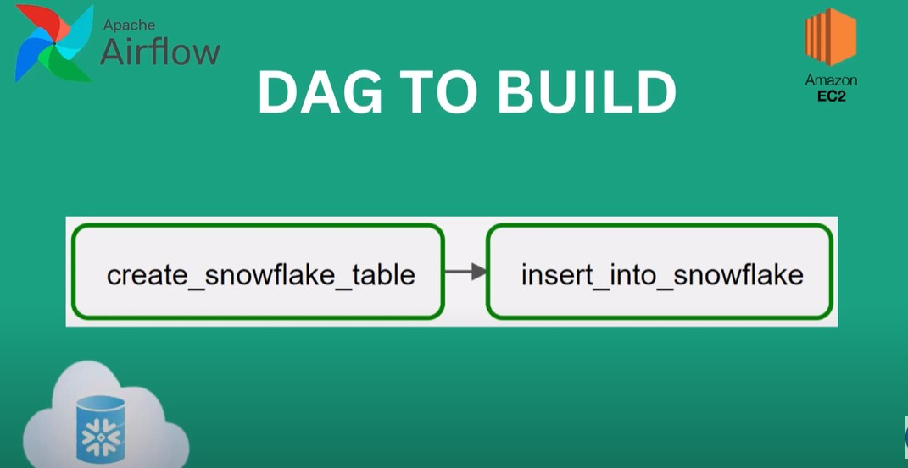

# ETL-Snowflake
# Airflow + Snowflake ETL Project  

This project demonstrates how to set up **Apache Airflow in Docker** and use it to orchestrate ETL tasks with **Snowflake**. The DAG included in this project:  
1. Creates a table in Snowflake.  
2. Inserts sample records into the table.  

-

## Project Architecture

 
-
## 🚀 Project Overview  

- **Airflow** is containerized with **Docker Compose**.  
- A custom DAG connects to **Snowflake** using the Airflow Snowflake provider.  
- Tasks are executed in the following order:  
  1. Create a target table in Snowflake (if not exists).  
  2. Insert multiple rows of sample data into the table.  

-

## 📂 Project Structure  

```bash
.
├── dags/
│   └── snowflake_dag.py      # Airflow DAG for Snowflake operations
├── docker-compose.yaml       # Docker Compose setup for Airflow
├── requirements.txt          # Python dependencies for Airflow
└── README.md                 # Project documentation
